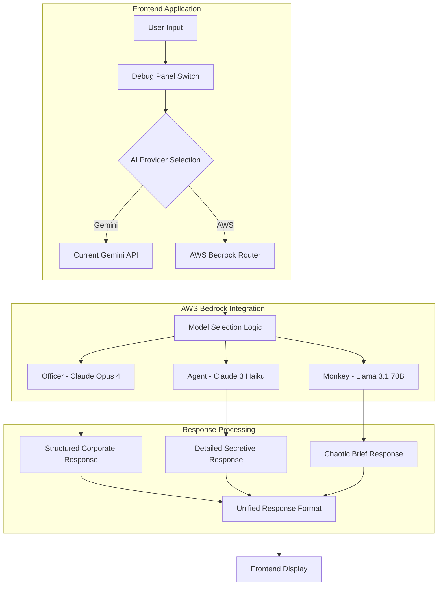

# AWS Bedrock Integration Plan for Multi-Model Email Generation

## 🚀 Quick Start: AWS Setup Guide

### Step 1: AWS Account & Bedrock Access Setup

#### 1.1 Enable AWS Bedrock in Your Account
1. **Log into AWS Console**: https://console.aws.amazon.com/
2. **Navigate to Bedrock**: Search for "Bedrock" in the AWS Console search bar
3. **Select Your Region**: Choose a region that supports Bedrock (recommended: `us-east-1` or `us-west-2`)
4. **Enable Bedrock**: If this is your first time, you may need to enable the service

#### 1.2 Request Model Access (CRITICAL STEP)
**⚠️ Important**: You must request access to each model individually. This can take a few minutes to several hours.

1. **Go to Bedrock Console** → **Model Access** (left sidebar)
2. **Request access for these specific models**:
   - ✅ **Anthropic Claude Opus 4** (`anthropic.claude-opus-4-v1:0`)
   - ✅ **Anthropic Claude 3 Haiku** (`anthropic.claude-3-haiku-20240307-v1:0`) 
   - ✅ **Meta Llama 3.1 70B Instruct** (`meta.llama3-1-70b-instruct-v1:0`)

3. **Fill out the access request form** for each model:
   - Use case: "Email generation for productivity application"
   - Expected usage: "Low to moderate volume for development/testing"
   - Click "Request model access"

#### 1.3 Create IAM User for Bedrock Access
1. **Go to IAM Console** → **Users** → **Create User**
2. **Username**: `bedrock-email-app-user`
3. **Attach policies directly**:
   ```json
   {
     "Version": "2012-10-17",
     "Statement": [
       {
         "Effect": "Allow",
         "Action": [
           "bedrock:InvokeModel",
           "bedrock:InvokeModelWithResponseStream"
         ],
         "Resource": [
           "arn:aws:bedrock:*::foundation-model/anthropic.claude-opus-4-v1:0",
           "arn:aws:bedrock:*::foundation-model/anthropic.claude-3-haiku-20240307-v1:0",
           "arn:aws:bedrock:*::foundation-model/meta.llama3-1-70b-instruct-v1:0"
         ]
       }
     ]
   }
   ```
4. **Create Access Keys**: Security credentials → Create access key → Application running outside AWS

#### 1.4 Test Your Setup
Use AWS CLI to verify access:
```bash
# Install AWS CLI if you haven't
npm install -g aws-cli

# Configure credentials
aws configure
# Enter your Access Key ID, Secret Access Key, region (us-east-1), output format (json)

# Test Bedrock access
aws bedrock list-foundation-models --region us-east-1
```

### Step 2: Environment Configuration
Add these to your `.env.local` file:
```bash
# AWS Bedrock Configuration
AWS_ACCESS_KEY_ID=your_access_key_here
AWS_SECRET_ACCESS_KEY=your_secret_access_key_here
AWS_REGION=us-east-1
AWS_BEDROCK_ENABLED=false

# Keep existing Gemini as fallback
GOOGLE_API_KEY=your_existing_gemini_key
```

---

## 🎯 Project Overview

Transform the current Gemini-only AI system into a sophisticated multi-model AWS Bedrock implementation that leverages different AI models to create distinct personality archetypes for each character.

### Model-Personality Mapping (Updated with Latest Models)
- **Officer**: Claude Opus 4 (Highest intelligence, complex reasoning, authoritative responses)
- **Agent**: Claude Sonnet 4 (Advanced reasoning with efficiency, detailed secretive responses)
- **Monkey**: Llama 3.3 70B Instruct (Latest creative model, chaotic brief responses)

## 🏗️ Architecture Design



## 📋 Implementation Plan

### Phase 1: AWS Setup & Configuration ✅ (You're doing this now!)

#### 1.1 AWS Account Setup
- **AWS Bedrock Access**: Ensure your AWS account has Bedrock access in your preferred region
- **Model Access**: Request access to required models (see Quick Start above)

#### 1.2 Environment Configuration
```bash
# Add to .env.local
AWS_ACCESS_KEY_ID=your_access_key
AWS_SECRET_ACCESS_KEY=your_secret_key
AWS_REGION=us-east-1  # or your preferred region
AWS_BEDROCK_ENABLED=false  # Default to false, toggle via debug panel
```

### Phase 2: Core Infrastructure

#### 2.1 AWS Bedrock Client Setup
**File**: `sad-email-frontend/src/lib/bedrock.ts`
```typescript
import { BedrockRuntimeClient, InvokeModelCommand } from "@aws-sdk/client-bedrock-runtime";

export interface BedrockConfig {
  region: string;
  accessKeyId: string;
  secretAccessKey: string;
}

export interface ModelConfig {
  modelId: string;
  maxTokens: number;
  temperature: number;
  topP?: number;
}

export const BEDROCK_MODELS = {
  officer: {
    modelId: "anthropic.claude-opus-4-20250514-v1:0",
    maxTokens: 150,
    temperature: 0.2, // Lower for more consistent, authoritative responses
    topP: 0.9
  },
  agent: {
    modelId: "anthropic.claude-3-haiku-20240307-v1:0",
    maxTokens: 200,
    temperature: 0.4, // Balanced for detailed but consistent responses
    topP: 0.8
  },
  monkey: {
    modelId: "meta.llama3-1-70b-instruct-v1:0",
    maxTokens: 120,
    temperature: 0.9, // Higher for maximum creativity and chaos
    topP: 0.95
  }
} as const;

export type PersonaType = keyof typeof BEDROCK_MODELS;

export class BedrockEmailGenerator {
  private client: BedrockRuntimeClient;

  constructor(config: BedrockConfig) {
    this.client = new BedrockRuntimeClient({
      region: config.region,
      credentials: {
        accessKeyId: config.accessKeyId,
        secretAccessKey: config.secretAccessKey,
      },
    });
  }

  async generateForPersona(persona: PersonaType, prompt: string, userInput: string) {
    const modelConfig = BEDROCK_MODELS[persona];
    
    const fullPrompt = `${prompt}\n\nUser's sad content/idea: "${userInput}"\n\nPlease write a professional email based on the user's content following the character's personality and style. Format your response as JSON with "subject" and "body" fields.`;

    const payload = this.buildPayload(modelConfig.modelId, fullPrompt, modelConfig);
    
    const command = new InvokeModelCommand({
      modelId: modelConfig.modelId,
      body: JSON.stringify(payload),
      contentType: "application/json",
      accept: "application/json",
    });

    try {
      const response = await this.client.send(command);
      const responseBody = JSON.parse(new TextDecoder().decode(response.body));
      
      return this.parseResponse(modelConfig.modelId, responseBody);
    } catch (error) {
      console.error(`Error generating email for ${persona}:`, error);
      throw error;
    }
  }

  private buildPayload(modelId: string, prompt: string, config: ModelConfig) {
    if (modelId.includes('anthropic.claude')) {
      return {
        anthropic_version: "bedrock-2023-05-31",
        max_tokens: config.maxTokens,
        temperature: config.temperature,
        top_p: config.topP,
        messages: [
          {
            role: "user",
            content: prompt
          }
        ]
      };
    } else if (modelId.includes('meta.llama')) {
      return {
        prompt: prompt,
        max_gen_len: config.maxTokens,
        temperature: config.temperature,
        top_p: config.topP,
      };
    }
    
    throw new Error(`Unsupported model: ${modelId}`);
  }

  private parseResponse(modelId: string, responseBody: any) {
    let responseText = "";
    
    if (modelId.includes('anthropic.claude')) {
      responseText = responseBody.content[0].text;
    } else if (modelId.includes('meta.llama')) {
      responseText = responseBody.generation;
    }

    // Try to parse as JSON first
    try {
      const parsed = JSON.parse(responseText);
      if (parsed.subject && parsed.body) {
        return {
          subject: parsed.subject,
          body: parsed.body
        };
      }
    } catch (e) {
      // If JSON parsing fails, try to extract JSON from markdown code blocks
      const jsonMatch = responseText.match(/```json\s*(\{[\s\S]*?\})\s*```/);
      if (jsonMatch) {
        try {
          const parsed = JSON.parse(jsonMatch[1]);
          if (parsed.subject && parsed.body) {
            return {
              subject: parsed.subject,
              body: parsed.body
            };
          }
        } catch (e2) {
          // Continue to fallback
        }
      }
      
      // Fallback: extract subject and body manually
      const lines = responseText.split('\n').filter(line => line.trim());
      
      let subject = 'Email';
      let body = responseText;
      
      for (let i = 0; i < lines.length; i++) {
        const line = lines[i].toLowerCase();
        if (line.includes('subject:') || line.includes('"subject"')) {
          subject = lines[i].replace(/.*subject:?\s*/i, '').replace(/^["']|["']$/g, '').replace(/^.*"subject"\s*:\s*["']?([^"']+)["']?.*$/, '$1');
          body = lines.slice(i + 1).join('\n');
          break;
        }
      }
      
      return {
        subject: subject || "Email",
        body: body || responseText
      };
    }

    // Final fallback
    return {
      subject: "Email",
      body: responseText
    };
  }
}
```

#### 2.2 Enhanced API Route
**File**: `sad-email-frontend/src/app/api/generate-email/route.ts`
```typescript
import { NextRequest, NextResponse } from 'next/server'
import { GoogleGenAI } from "@google/genai"
import { BedrockEmailGenerator } from '@/lib/bedrock'
import fs from 'fs'
import path from 'path'

// Initialize the Gemini client (existing)
const ai = new GoogleGenAI({ 
  apiKey: process.env.GOOGLE_API_KEY || "" 
})

export async function POST(request: NextRequest) {
  try {
    const { userInput, useAWS = false } = await request.json()

    if (!userInput) {
      return NextResponse.json(
        { error: 'Missing userInput' },
        { status: 400 }
      )
    }

    if (useAWS) {
      return await generateWithBedrock(userInput);
    } else {
      return await generateWithGemini(userInput);
    }

  } catch (error) {
    console.error("Error generating emails:", error)
    return NextResponse.json(
      { 
        agentInitialEmail: { subject: "Error", body: "Failed to generate agent email" },
        officerInitialEmail: { subject: "Error", body: "Failed to generate officer email" },
        monkeyInitialEmail: { subject: "Error", body: "Failed to generate monkey email" },
        success: false,
        error: error instanceof Error ? error.message : "Unknown error"
      },
      { status: 500 }
    )
  }
}

async function generateWithBedrock(userInput: string) {
  if (!process.env.AWS_ACCESS_KEY_ID || !process.env.AWS_SECRET_ACCESS_KEY) {
    return NextResponse.json(
      { error: 'AWS credentials not configured' },
      { status: 500 }
    )
  }

  const bedrockGenerator = new BedrockEmailGenerator({
    region: process.env.AWS_REGION || 'us-east-1',
    accessKeyId: process.env.AWS_ACCESS_KEY_ID,
    secretAccessKey: process.env.AWS_SECRET_ACCESS_KEY,
  });

  // Read prompt files
  const agentPrompt = fs.readFileSync(path.join(process.cwd(), 'public/prompt/agent_prompt.md'), 'utf8')
  const officerPrompt = fs.readFileSync(path.join(process.cwd(), 'public/prompt/officer_prompt.md'), 'utf8')
  const monkeyPrompt = fs.readFileSync(path.join(process.cwd(), 'public/prompt/monkey_prompt.md'), 'utf8')

  // Generate all three emails in parallel with different models
  const [agentResponse, officerResponse, monkeyResponse] = await Promise.all([
    bedrockGenerator.generateForPersona('agent', agentPrompt, userInput),
    bedrockGenerator.generateForPersona('officer', officerPrompt, userInput),
    bedrockGenerator.generateForPersona('monkey', monkeyPrompt, userInput)
  ])

  return NextResponse.json({
    agentInitialEmail: agentResponse,
    officerInitialEmail: officerResponse,
    monkeyInitialEmail: monkeyResponse,
    success: true,
    provider: 'aws-bedrock'
  })
}

async function generateWithGemini(userInput: string) {
  // Existing Gemini implementation (unchanged)
  if (!process.env.GOOGLE_API_KEY) {
    return NextResponse.json(
      { error: 'GOOGLE_API_KEY is not configured' },
      { status: 500 }
    )
  }

  // Read prompt files
  const agentPrompt = fs.readFileSync(path.join(process.cwd(), 'public/prompt/agent_prompt.md'), 'utf8')
  const officerPrompt = fs.readFileSync(path.join(process.cwd(), 'public/prompt/officer_prompt.md'), 'utf8')
  const monkeyPrompt = fs.readFileSync(path.join(process.cwd(), 'public/prompt/monkey_prompt.md'), 'utf8')

  // Generate all three emails in parallel
  const [agentResponse, officerResponse, monkeyResponse] = await Promise.all([
    generateEmailWithPrompt(agentPrompt, userInput),
    generateEmailWithPrompt(officerPrompt, userInput),
    generateEmailWithPrompt(monkeyPrompt, userInput)
  ])

  return NextResponse.json({
    agentInitialEmail: agentResponse,
    officerInitialEmail: officerResponse,
    monkeyInitialEmail: monkeyResponse,
    success: true,
    provider: 'gemini'
  })
}

// Existing Gemini helper function (unchanged)
async function generateEmailWithPrompt(prompt: string, userInput: string) {
  const fullPrompt = `${prompt}

User's sad content/idea: "${userInput}"

Please write a professional email based on the user's content. The email should:
1. Have a clear, professional subject line
2. Follow the character's personality and style
3. Be well-formatted and appropriate for business communication
4. Transform the user's sad content into a proper email

Format your response as JSON with "subject" and "body" fields.`

  const response = await ai.models.generateContent({
    model: "gemini-2.5-flash",
    contents: fullPrompt,
    config: {
      temperature: 0.7,
      thinkingConfig: {
        thinkingBudget: 0,
      },
    },
  })

  const responseText = response.text || ""
  
  // Try to parse as JSON first
  try {
    const parsed = JSON.parse(responseText)
    if (parsed.subject && parsed.body) {
      return {
        subject: parsed.subject,
        body: parsed.body
      }
    }
  } catch (e) {
    // If JSON parsing fails, try to extract JSON from markdown code blocks
    const jsonMatch = responseText.match(/```json\s*(\{[\s\S]*?\})\s*```/)
    if (jsonMatch) {
      try {
        const parsed = JSON.parse(jsonMatch[1])
        if (parsed.subject && parsed.body) {
          return {
            subject: parsed.subject,
            body: parsed.body
          }
        }
      } catch (e2) {
        // Continue to fallback
      }
    }
    
    // If JSON parsing fails, extract subject and body manually
    const lines = responseText.split('\n').filter(line => line.trim())
    
    // Look for subject and body patterns
    let subject = 'Email'
    let body = responseText
    
    for (let i = 0; i < lines.length; i++) {
      const line = lines[i].toLowerCase()
      if (line.includes('subject:') || line.includes('"subject"')) {
        subject = lines[i].replace(/.*subject:?\s*/i, '').replace(/^["']|["']$/g, '').replace(/^.*"subject"\s*:\s*["']?([^"']+)["']?.*$/, '$1')
        body = lines.slice(i + 1).join('\n')
        break
      }
    }
    
    return {
      subject: subject || "Email",
      body: body || responseText
    }
  }

  // Fallback: return the raw response
  return {
    subject: "Email",
    body: responseText
  }
}
```

### Phase 3: Model-Specific Implementations

#### 3.1 Officer Personality (Claude Opus 4)
**Characteristics**: Highly intelligent, structured, corporate
**Configuration**:
- Temperature: 0.3 (consistent, professional)
- Max Tokens: 150 (structured responses)
- Focus: Authority, hierarchy, deadlines

#### 3.2 Agent Personality (Claude 3 Haiku)
**Characteristics**: Fast, detailed, secretive
**Configuration**:
- Temperature: 0.5 (balanced creativity/consistency)
- Max Tokens: 200 (detailed responses)
- Focus: Thoroughness, documentation, cryptic language

#### 3.3 Monkey Personality (Llama 3.1 70B)
**Characteristics**: Creative, chaotic, brief
**Configuration**:
- Temperature: 0.8 (high creativity/randomness)
- Max Tokens: 120 (brief responses)
- Focus: Humor, brevity, tech slang

### Phase 4: Debug Panel Integration

#### 4.1 Enhanced Debug Panel
**File**: `sad-email-frontend/src/components/DebugPanel.tsx`

Add AWS Bedrock toggle section:
```typescript
// Add to imports
import { useState } from "react"

// Add state for AWS toggle
const [useAWS, setUseAWS] = useState(false)

// Add this section to the debug panel render
// AI Provider Selection
<div className="mb-3">
  <div className="text-cyan-400">AI PROVIDER SELECTION:</div>
  <div className="flex items-center gap-4 mt-1">
    <label className="flex items-center gap-2">
      <input
        type="radio"
        name="aiProvider"
        value="gemini"
        checked={!useAWS}
        onChange={() => setUseAWS(false)}
        className="text-green-400"
      />
      <span>Gemini (Current)</span>
    </label>
    <label className="flex items-center gap-2">
      <input
        type="radio"
        name="aiProvider"
        value="aws"
        checked={useAWS}
        onChange={() => setUseAWS(true)}
        className="text-green-400"
      />
      <span>AWS Bedrock (Multi-Model)</span>
    </label>
  </div>
  
  {useAWS && (
    <div className="mt-2 text-xs text-green-500">
      <div>Officer: Claude Opus 4 (Maximum Intelligence, Structured)</div>
      <div>Agent: Claude 3 Haiku (Fast, Detailed)</div>
      <div>Monkey: Llama 3.1 70B (Creative, Chaotic)</div>
    </div>
  )}
</div>
```

### Phase 5: Enhanced Frontend Integration

#### 5.1 Updated Gemini Library
**File**: `sad-email-frontend/src/lib/gemini.ts`
```typescript
export interface EmailGenerationRequest {
  userInput: string;
  useAWS?: boolean; // New optional parameter
}

export async function generateEmail(request: EmailGenerationRequest): Promise<EmailGenerationResponse> {
  const response = await fetch('/api/generate-email', {
    method: 'POST',
    headers: { 'Content-Type': 'application/json' },
    body: JSON.stringify({
      userInput: request.userInput,
      useAWS: request.useAWS || false
    }),
  });
  // ... rest of implementation unchanged
}
```

#### 5.2 State Management Updates
**File**: `sad-email-frontend/src/main-game.tsx`
```typescript
// Add state for AWS toggle
const [useAWS, setUseAWS] = useState(false);

// Update email submit handler
const handleEmailSubmit = async (userInput: string) => {
  console.log("Email submitted:", userInput)
  
  setUserSadInput(userInput)
  setIsGeneratingEmail(true)
  
  try {
    const emailResponse = await generateEmail({
      userInput,
      useAWS // Pass the AWS toggle state
    })

    if (emailResponse.success) {
      setGeneratedEmails(emailResponse)
      setGameState("agent-responses")
    } else {
      console.error("Failed to generate emails:", emailResponse.error)
      // ... rest of error handling unchanged
    }
  } catch (error) {
    // ... error handling unchanged
  } finally {
    setIsGeneratingEmail(false)
  }
}

// Pass useAWS state to debug info
debugInfo={{
  // ... existing debug info
  useAWS,
  setUseAWS
}}
```

## 🔧 Technical Implementation Details

### Dependencies to Add
```json
{
  "@aws-sdk/client-bedrock-runtime": "^3.x.x",
  "@aws-sdk/credential-providers": "^3.x.x"
}
```

Install with:
```bash
npm install @aws-sdk/client-bedrock-runtime @aws-sdk/credential-providers
```

### Environment Variables
```bash
# AWS Configuration
AWS_ACCESS_KEY_ID=your_access_key_here
AWS_SECRET_ACCESS_KEY=your_secret_access_key_here
AWS_REGION=us-east-1
AWS_BEDROCK_ENABLED=false

# Existing Gemini (keep as fallback)
GOOGLE_API_KEY=your_existing_key
```

### Model Mapping Strategy
```typescript
const MODEL_PERSONALITY_MAP = {
  officer: {
    model: "anthropic.claude-opus-4-v1:0",
    traits: ["authoritative", "structured", "corporate"],
    temperature: 0.3,
    focus: "hierarchy and deadlines"
  },
  agent: {
    model: "anthropic.claude-3-haiku-20240307-v1:0",
    traits: ["detailed", "secretive", "thorough"],
    temperature: 0.5,
    focus: "documentation and precision"
  },
  monkey: {
    model: "meta.llama3-1-70b-instruct-v1:0",
    traits: ["chaotic", "creative", "brief"],
    temperature: 0.8,
    focus: "humor and brevity"
  }
};
```

## 🚀 Rollout Strategy

### Phase 1: Foundation (Week 1) ← **YOU ARE HERE**
1. ✅ Set up AWS Bedrock access and model permissions
2. ✅ Create basic Bedrock client infrastructure  
3. ✅ Add debug panel toggle for AWS/Gemini selection

### Phase 2: Core Integration (Week 2)
1. Implement model-specific generation logic
2. Update API routes to support both providers
3. Test basic multi-model functionality

### Phase 3: Personality Refinement (Week 3)
1. Fine-tune model parameters for each personality
2. Implement personality-specific prompt engineering
3. Add comprehensive error handling and fallbacks

### Phase 4: Production Ready (Week 4)
1. Add monitoring and logging
2. Implement cost tracking for Bedrock usage
3. Performance optimization and caching strategies

## 💰 Cost Considerations

### AWS Bedrock Pricing (Approximate)
- **Claude Opus 4**: ~$15.00 per 1M input tokens, ~$75.00 per 1M output tokens
- **Claude 3 Haiku**: ~$0.25 per 1M input tokens, ~$1.25 per 1M output tokens  
- **Llama 3.1 70B**: ~$0.99 per 1M input tokens, ~$0.99 per 1M output tokens

### Cost Optimization
- Implement response caching for similar inputs
- Use shorter context windows where possible
- Monitor usage via CloudWatch
- Set up billing alerts

## 🔍 Testing Strategy

### Unit Tests
- Model selection logic
- Response formatting
- Error handling scenarios

### Integration Tests  
- End-to-end email generation flow
- Provider switching functionality
- Fallback mechanisms

### User Acceptance Tests
- Personality distinctiveness verification
- Response quality comparison
- Performance benchmarking

## 📊 Success Metrics

### Technical Metrics
- Response time comparison (Gemini vs Bedrock)
- Error rates and fallback usage
- Cost per generation

### Quality Metrics
- Personality distinctiveness scores
- User preference testing
- Response coherence evaluation

## 🛡️ Security & Compliance

### AWS Security
- Use IAM roles with minimal required permissions
- Implement request signing and authentication
- Store credentials securely (AWS Secrets Manager recommended)

### Data Privacy
- Ensure no sensitive data is logged
- Implement request/response sanitization
- Consider data residency requirements

## 🔗 Helpful Resources

### AWS Documentation
- [AWS Bedrock User Guide](https://docs.aws.amazon.com/bedrock/latest/userguide/)
- [Bedrock Model IDs Reference](https://docs.aws.amazon.com/bedrock/latest/userguide/model-ids.html)
- [Bedrock API Reference](https://docs.aws.amazon.com/bedrock/latest/APIReference/)

### AWS SDK Documentation
- [AWS SDK for JavaScript v3](https://docs.aws.amazon.com/AWSJavaScriptSDK/v3/latest/)
- [Bedrock Runtime Client](https://docs.aws.amazon.com/AWSJavaScriptSDK/v3/latest/client/bedrock-runtime/)

### Example Repositories (Your References)
- [Crypto AI Agents with Amazon Bedrock](https://github.com/aws-samples/crypto-ai-agents-with-amazon-bedrock)
- [Amazon Bedrock Samples](https://github.com/aws-samples/amazon-bedrock-samples)

---

## 🎯 Next Steps

1. **Complete AWS Setup** (You're doing this now!)
   - Request model access in Bedrock console
   - Create IAM user with proper permissions
   - Test access with AWS CLI

2. **Update Environment Variables**
   - Add AWS credentials to `.env.local`
   - Set `AWS_BEDROCK_ENABLED=true` when ready

3. **Ready for Code Implementation**
   - Let me know when your AWS setup is complete
   - We'll implement the Bedrock integration step by step

This plan provides a comprehensive roadmap for integrating AWS Bedrock's multi-model capabilities while maintaining backward compatibility with your existing Gemini implementation. The debug panel toggle allows for easy A/B testing and gradual rollout.