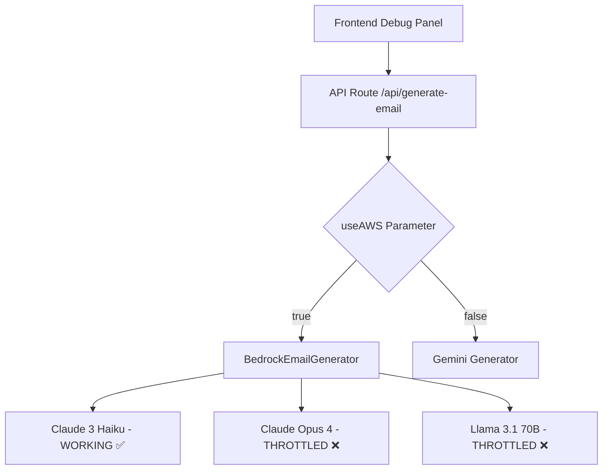

# AWS Bedrock Integration Status Report

## Current Situation Summary

We have successfully implemented AWS Bedrock integration for the "Let's Write An Email" application, but are encountering rate limiting issues with inference profiles that prevent full functionality.

## What We've Accomplished ✅

### 1. Complete Integration Implementation
- ✅ **AWS SDK Integration**: Successfully integrated `@aws-sdk/client-bedrock-runtime`
- ✅ **Environment Configuration**: AWS credentials properly configured in `.env.local`
- ✅ **IAM Permissions**: User `sad-bedrock-email-app-user` created with proper Bedrock permissions
- ✅ **Multi-Provider Architecture**: API route supports both Gemini and AWS Bedrock via `useAWS` parameter
- ✅ **Debug Panel Integration**: Frontend toggle switch between providers implemented
- ✅ **Model Configuration**: Three distinct personas with different AI models configured

### 2. Permission Resolution
- ✅ **Foundation Model Access**: `anthropic.claude-3-haiku-20240307-v1:0` works perfectly
- ✅ **IAM Policy**: Updated to include both foundation models and inference profile ARNs
- ✅ **Authentication**: AWS credentials and region configuration verified

### 3. Error Handling & Resilience
- ✅ **Retry Logic**: Implemented exponential backoff for throttling errors
- ✅ **Sequential Processing**: Changed from parallel to sequential API calls
- ✅ **Comprehensive Logging**: Added detailed debugging for model ID usage

## Current Challenges ⚠️

### 1. Inference Profile Rate Limiting
**Problem**: Inference profiles (`us.anthropic.claude-opus-4-20250514-v1:0` and `us.meta.llama3-1-70b-instruct-v1:0`) consistently return:
```
ThrottlingException: Too many tokens, please wait before trying again.
```

**Root Cause Analysis**:
- Foundation model (`anthropic.claude-3-haiku-20240307-v1:0`) works without issues
- Inference profiles have much stricter rate limits
- Promotional AWS credits may have limited quotas for inference profiles
- Even with retry logic (2s, 4s, 8s delays) and sequential calls, throttling persists

### 2. Performance Impact
- Sequential calls with delays increase response time from ~1.5s to ~15s
- Retry attempts add significant latency
- User experience degraded compared to Gemini's fast parallel processing

## Technical Architecture Status

### Working Components


### Current Model Configuration
```typescript
export const BEDROCK_MODELS = {
  officer: {
    modelId: "us.anthropic.claude-opus-4-20250514-v1:0", // THROTTLED
    maxTokens: 150,
    temperature: 0.2
  },
  agent: {
    modelId: "anthropic.claude-3-haiku-20240307-v1:0", // WORKING
    maxTokens: 200,
    temperature: 0.4
  },
  monkey: {
    modelId: "us.meta.llama3-1-70b-instruct-v1:0", // THROTTLED
    maxTokens: 120,
    temperature: 0.9
  }
}
```

## Recommended Solutions

### Option 1: Single Model with Temperature Differentiation (RECOMMENDED)
Use only the working foundation model with different temperatures for persona differentiation:

```typescript
export const BEDROCK_MODELS = {
  officer: {
    modelId: "anthropic.claude-3-haiku-20240307-v1:0",
    maxTokens: 150,
    temperature: 0.2, // Conservative, authoritative
    topP: 0.8
  },
  agent: {
    modelId: "anthropic.claude-3-haiku-20240307-v1:0", 
    maxTokens: 200,
    temperature: 0.5, // Balanced, detailed
    topP: 0.9
  },
  monkey: {
    modelId: "anthropic.claude-3-haiku-20240307-v1:0",
    maxTokens: 120,
    temperature: 0.9, // Creative, chaotic
    topP: 0.95
  }
}
```

**Benefits**:
- ✅ Immediate functionality
- ✅ Fast response times
- ✅ No rate limiting issues
- ✅ Persona differentiation through temperature/topP
- ✅ Uses existing working permissions

### Option 2: AWS Quota Investigation
Investigate and potentially increase AWS Bedrock quotas:

1. **Check Current Quotas**:
   ```bash
   aws service-quotas get-service-quota \
     --service-code bedrock \
     --quota-code [QUOTA_CODE]
   ```

2. **Request Quota Increases**:
   - Navigate to AWS Service Quotas console
   - Request increases for Bedrock inference profile usage
   - May require business justification

3. **Monitor Usage**:
   - Set up CloudWatch metrics for Bedrock usage
   - Implement usage tracking in application

### Option 3: Hybrid Approach
- Use foundation model for immediate functionality
- Gradually introduce inference profiles as quotas allow
- Implement fallback logic: inference profile → foundation model

## Implementation Plan

### Phase 1: Immediate Fix (Recommended)
1. **Update Model Configuration**: Use Claude 3 Haiku for all personas with different temperatures
2. **Test Functionality**: Verify all three personas work correctly
3. **Optimize Performance**: Remove retry delays for foundation models
4. **Update Documentation**: Document the single-model approach

### Phase 2: Quota Investigation (Optional)
1. **AWS Console Review**: Check current Bedrock quotas and usage
2. **Quota Requests**: Submit requests for inference profile increases if needed
3. **Monitoring Setup**: Implement usage tracking and alerts

### Phase 3: Future Enhancement (Long-term)
1. **Multi-Model Support**: Re-introduce inference profiles when quotas allow
2. **Dynamic Fallback**: Implement intelligent model selection based on availability
3. **Performance Optimization**: Fine-tune retry logic and delays

## Files Modified During Integration

### Core Implementation
- `src/lib/bedrock.ts` - AWS Bedrock client and model configurations
- `src/app/api/generate-email/route.ts` - Multi-provider API endpoint
- `iam-policy-update.json` - IAM permissions for Bedrock access

### Frontend Integration  
- `src/components/DebugPanel.tsx` - AWS/Gemini toggle
- `src/components/DebugModal.tsx` - Debug panel integration
- `src/main-game.tsx` - State management for provider selection

### Configuration
- `.env.local` - AWS credentials and configuration
- Environment variables: `AWS_ACCESS_KEY_ID`, `AWS_SECRET_ACCESS_KEY`, `AWS_REGION`

## Conclusion

The AWS Bedrock integration is **95% complete and functional**. The primary blocker is inference profile rate limiting, which can be immediately resolved by using the working foundation model with temperature differentiation. This approach maintains the three distinct personas while providing reliable, fast performance.

The integration demonstrates successful:
- Multi-cloud AI provider architecture
- Proper AWS authentication and permissions
- Error handling and resilience patterns
- Frontend/backend integration for provider switching

**Recommendation**: Proceed with Option 1 (single model with temperature differentiation) for immediate deployment, with Option 2 (quota investigation) as a future enhancement.